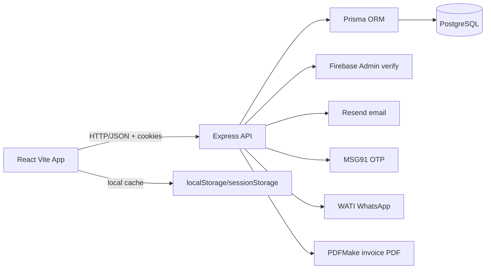
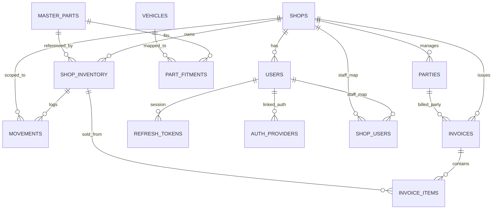
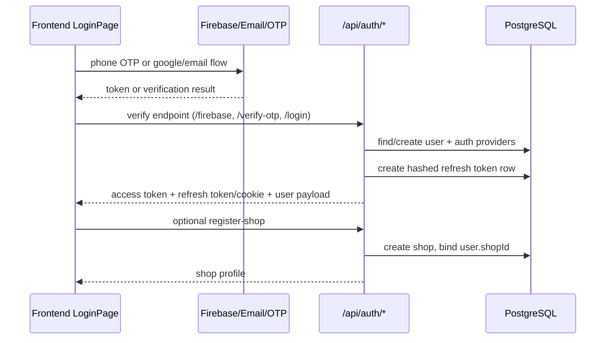
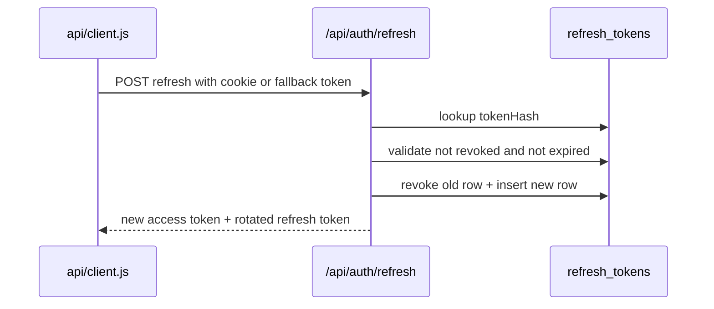
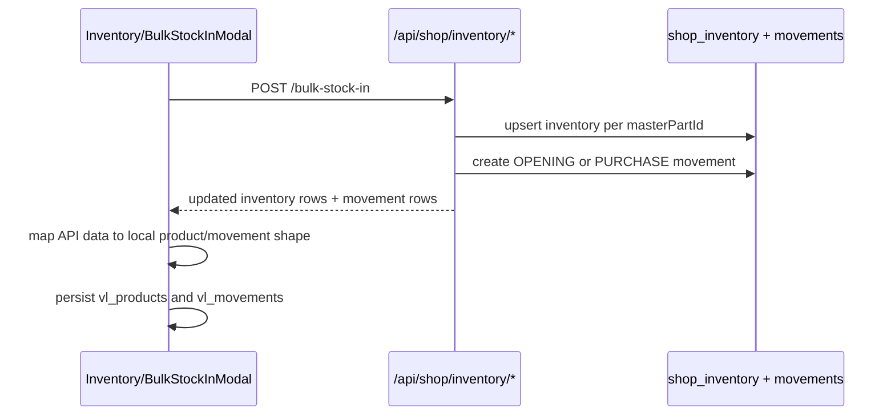
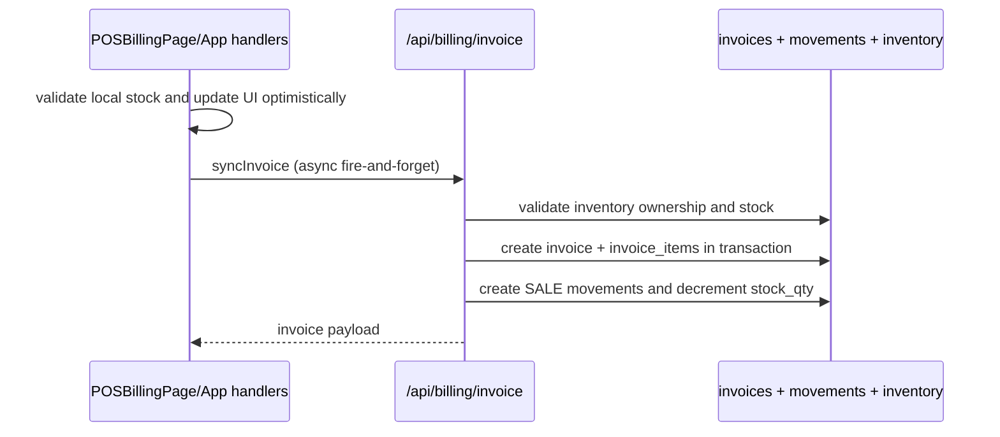
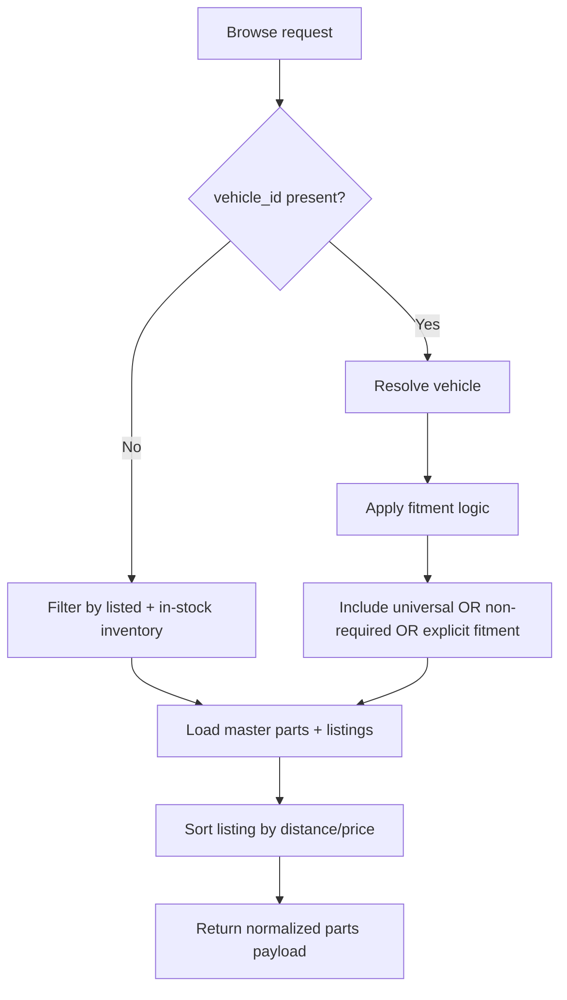
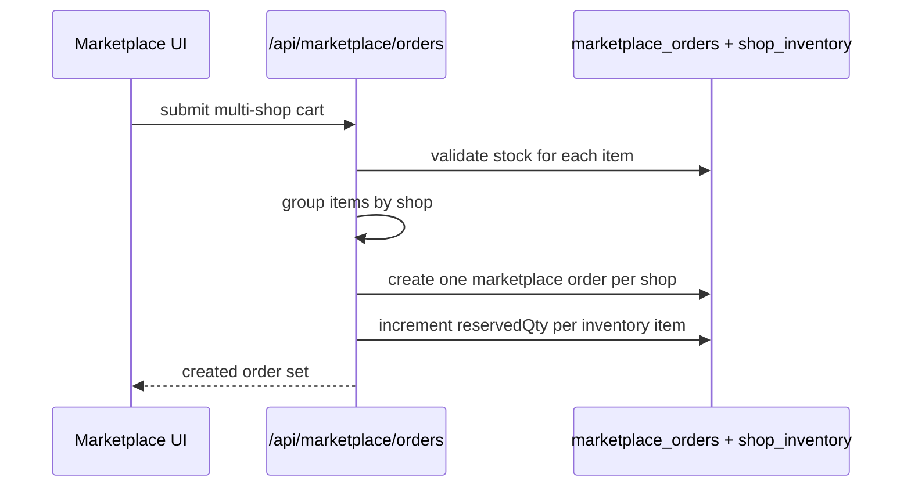
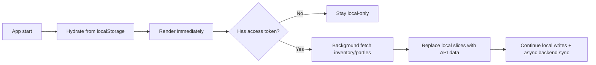

# AutoSpace Developer Handbook

Last updated: 2026-04-09
Audience: New and existing engineers working on GearItUp/AutoSpace

## 1) What this project is

AutoSpace is a dual-surface product for the Indian auto-parts market:

- ERP/POS surface for shop operators (inventory, billing, parties, reports)
- Marketplace surface for customers/mechanics (fitment-first discovery and ordering)

The repository currently runs as a hybrid architecture:

- Frontend keeps a full local state model (localStorage-first)
- Backend APIs are live and used for auth, inventory, billing, parties, catalog, and marketplace
- Frontend progressively syncs local state with backend where available

## 2) Current architecture snapshot

## 2.1 Runtime topology



## 2.2 Frontend boot

- Entry: src/main.jsx
- Router: BrowserRouter from react-router-dom
- Global state: StoreContext from src/store.js
- Main app shell and routes: src/App.jsx

## 2.3 Backend boot

- Entry: backend/src/index.js
- Middleware order:
  - CORS allowlist (FRONTEND_URL or localhost defaults)
  - express.json
  - cookieParser
  - auth rate limiter on /api/auth
  - route mounts
  - 404 handler
  - global error handler

## 3) Repository structure (engineering view)

```text
.
|- src/
|  |- App.jsx                         # Route tree and ERP shell
|  |- store.js                        # Global client state and persistence
|  |- api/                            # Frontend API clients and sync bridge
|  |- pages/                          # ERP pages (dashboard/inventory/billing/reports...)
|  |- marketplace/                    # Marketplace components/pages/engine
|  |- components/                     # Shared components and modals
|  |- theme.js                        # Theme tokens and global CSS
|  |- utils.js                        # Seed data, ledger helpers, exports
|
|- backend/
|  |- src/index.js                    # Express server
|  |- src/routes/                     # Auth, inventory, billing, catalog, marketplace, etc.
|  |- src/middleware/                 # Auth, error, rate limit
|  |- src/services/                   # Firebase, email, OTP, PDF, WhatsApp
|  |- src/db/prisma.js                # Prisma bootstrap
|  |- prisma/schema.prisma            # Data model
|  |- prisma/seed.js                  # Vehicle/master-part demo seed
|  |- scripts/                        # Migration utility scripts
|
|- docs/                              # Developer documentation (this file + roadmap)
```

## 4) Frontend architecture

## 4.1 Route behavior in src/App.jsx

Active ERP routes:

- /dashboard
- /inventory
- /billing
- /reports

Auth/public routes:

- /login
- /reset-password

All other previously planned routes currently redirect to /dashboard (if logged in) or /login.

Implication for developers:

- Marketplace pages exist under src/marketplace/pages, but are not currently mounted in the active route tree.

## 4.2 Client state model in src/store.js

Store contains:

- shops, products, movements, orders, purchases
- parties, vehicles, jobCards
- receipts, auditLog
- UI/domain state: cart, selectedVehicle, appMode, activeShopId

Persistence pattern:

- Reads from localStorage on boot
- Writes through save* helpers
- Runs background syncFromAPI after boot if access token exists

Important invariant:

- Stock should be treated as ledger-driven. Movement rows are the source of truth for stock changes.

## 4.3 Local persistence keys

Main localStorage keys:

- vl_shops
- vl_products
- vl_movements
- vl_orders
- vl_purchases
- vl_parties
- vl_vehicles
- vl_jobCards
- vl_cart
- vl_vehicle
- vl_auditLog
- vl_receipts
- vl_appMode
- vl_shopId
- as_user
- as_refresh_token
- vl_suspended_bill
- vl_recent_searches

Main sessionStorage key:

- vl_low_stock_dismissed

## 4.4 Hybrid sync bridge in src/api/sync.js

Sync adapter responsibilities:

- map backend ShopInventory to frontend product shape
- map backend Movement and Party to frontend shape
- push fire-and-forget mutations:
  - syncInvoice
  - syncPurchase
  - syncAdjustment
  - syncProductSave

Guard behavior:

- API mutation push only occurs for UUID-like ids (DB records), to avoid corrupting backend with seed/demo ids.

## 5) Backend architecture

## 5.1 Security and auth model

Access token:

- JWT bearer token in Authorization header
- short-lived (default 8h)

Refresh token:

- httpOnly cookie (preferred)
- localStorage fallback supported for compatibility
- token hashing and rotation with revocation tracking in refresh_tokens

Role model:

- CUSTOMER
- SHOP_OWNER
- SHOP_STAFF
- PLATFORM_ADMIN

## 5.2 Route modules

Mounted API groups:

- /api/auth
- /api/catalog
- /api/shop/inventory
- /api/billing
- /api/shop/parties
- /api/shop/dashboard
- /api/marketplace
- /api/customer
- /api/shop/staff

## 5.3 Core domain invariant: immutable stock ledger

Stock-changing operations append Movement rows and then update cached stock_qty.

Movement types used for stock math:

- inbound: PURCHASE, OPENING, RETURN_IN
- outbound: SALE, RETURN_OUT, DAMAGE, THEFT
- signed adjustment: ADJUSTMENT, AUDIT
- financial-only (no stock change): RECEIPT, CREDIT_NOTE, DEBIT_NOTE

## 6) Data model and ownership boundaries

## 6.1 Three-layer parts model

Layer 1: Master catalog (global)

- master_parts
- part_fitments
- vehicles

Layer 2: Lookup and fitment intelligence

- barcode/OEM lookups
- fitment resolution by vehicle context

Layer 3: Shop inventory and transactions

- shop_inventory
- movements
- invoices/invoice_items
- parties

## 6.2 ER diagram (core entities)



## 7) End-to-end data flow diagrams

## 7.1 Auth and onboarding



## 7.2 Refresh token rotation



## 7.3 Inventory stock-in flow



## 7.4 POS billing and stock deduction flow



## 7.5 Marketplace browse fitment flow



## 7.6 Marketplace order flow



## 7.7 Local-first with background API sync



## 8) API surface summary

## 8.1 ERP

- Inventory: list/create/update, purchase, adjust, bulk stock-in, marketplace toggle
- Billing: create invoice, list invoices, PDF, WhatsApp send
- Parties: CRUD-lite plus ledger and payment receipt
- Dashboard: aggregate metrics + low-stock query

## 8.2 Marketplace

- browse, vehicles, vehicle lookup facets
- search
- order create, status update, order tracking
- product detail and review submission

## 8.3 Identity and profiles

- otp, email/password, firebase auth
- refresh/logout/session revoke
- provider linking
- profile/settings/shop update
- password reset and change

## 9) Environment variables

## 9.1 Frontend (.env at repo root)

Required:

- VITE_API_URL
- VITE_FIREBASE_API_KEY
- VITE_FIREBASE_AUTH_DOMAIN
- VITE_FIREBASE_PROJECT_ID
- VITE_FIREBASE_STORAGE_BUCKET
- VITE_FIREBASE_MESSAGING_SENDER_ID
- VITE_FIREBASE_APP_ID
- VITE_FIREBASE_MEASUREMENT_ID

## 9.2 Backend (backend/.env)

Core:

- DATABASE_URL (or DIRECT_URL fallback)
- PORT
- FRONTEND_URL (comma-separated allowlist)
- JWT_SECRET
- JWT_REFRESH_SECRET
- JWT_EXPIRES_IN (optional)
- JWT_REFRESH_EXPIRES_IN (optional)

Integrations:

- FIREBASE_PROJECT_ID
- FIREBASE_CLIENT_EMAIL
- FIREBASE_PRIVATE_KEY
- RESEND_API_KEY
- RESEND_SENDER_EMAIL
- RESEND_SENDER_NAME
- MSG91_AUTH_KEY
- MSG91_TEMPLATE_ID
- WATI_API_URL
- WATI_ACCESS_TOKEN
- FRONTEND_APP_URL and/or RESET_PASSWORD_URL

## 10) Developer workflows

From repository root:

- npm install
- npm run dev

Backend in separate terminal:

- cd backend
- npm install
- npm run dev

Database tasks (inside backend):

- npm run db:push
- npm run db:migrate
- npm run db:seed
- npm run db:studio

## 11) Known gaps and technical debt to watch

- No automated test framework currently configured.
- Frontend still carries legacy local-only assumptions in some paths.
- Some docs in the repo describe older architecture assumptions (for example, older statements about no router).
- Refresh token localStorage fallback exists for compatibility; long-term target should remain cookie-only session handling.
- Financial-only movement events currently attach to any inventory item for FK integrity in one path; this should be normalized when schema allows nullable financial movement linkage.

## 12) New developer onboarding checklist

1. Run frontend and backend locally and confirm health endpoint returns ok.
2. Verify login path (email and OTP dev mode) and inspect cookie/token behavior.
3. Create a shop, add inventory, and perform one purchase + one sale.
4. Confirm movement ledger rows are created and stock changes match expected math.
5. Browse marketplace with and without vehicle context to verify fitment filtering.
6. Read docs/MVP_AND_FEATURE_ROADMAP.md before starting new features.
